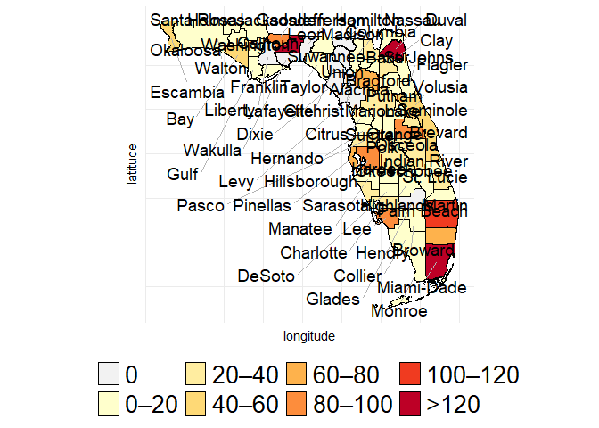
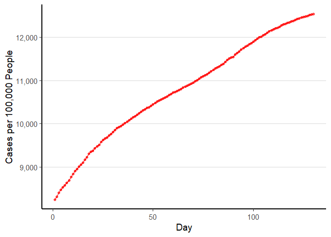
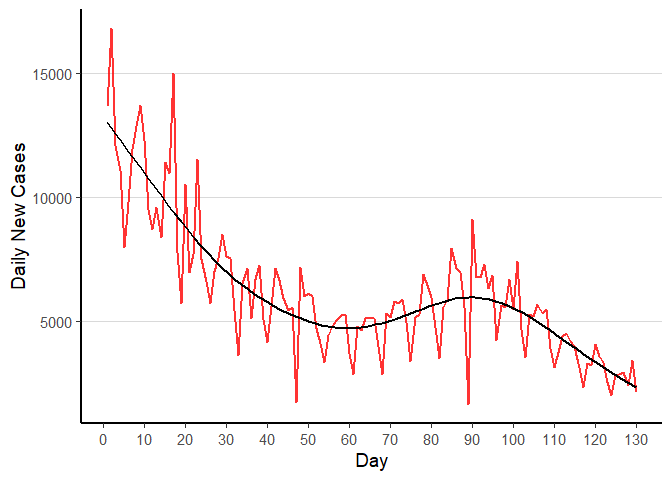
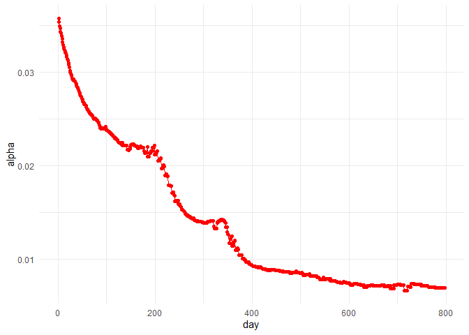
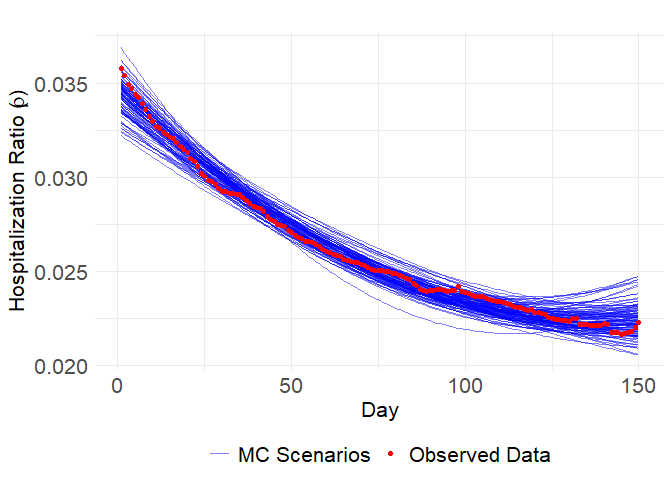
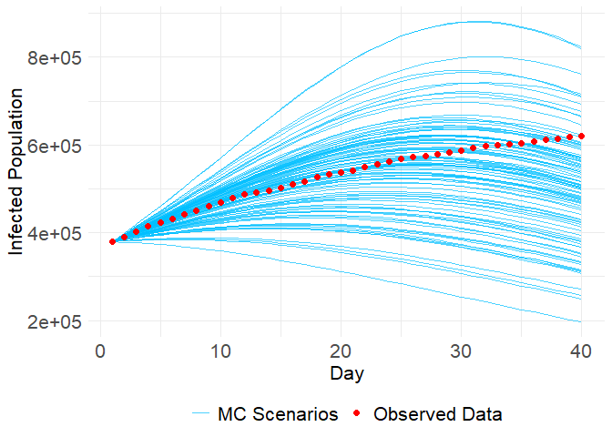

Epidemic-Resource-Allocation
================
Reza Abazari
2026-03-09

``` r
library(ggplot2)
library(sf)
```

    ## Linking to GEOS 3.12.2, GDAL 3.9.3, PROJ 9.4.1; sf_use_s2() is TRUE

``` r
library(tigris)
```

    ## To enable caching of data, set `options(tigris_use_cache = TRUE)`
    ## in your R script or .Rprofile.

``` r
library(ggrepel)
library(readxl)
library(dplyr)
```

    ## 
    ## Attaching package: 'dplyr'

    ## The following objects are masked from 'package:stats':
    ## 
    ##     filter, lag

    ## The following objects are masked from 'package:base':
    ## 
    ##     intersect, setdiff, setequal, union

``` r
library(censusapi)
```

    ## 
    ## Attaching package: 'censusapi'

    ## The following object is masked from 'package:methods':
    ## 
    ##     getFunction

``` r
library(units)
```

    ## udunits database from C:/Users/18503/AppData/Local/R/win-library/4.4/units/share/udunits/udunits2.xml

``` r
library(this.path)
```

    ## Warning: package 'this.path' was built under R version 4.4.3

``` r
script_dir <- this.dir()
options(tigris_use_cache = TRUE)


multi_counties <- counties(
  state = c("FL","AL","GA","MS"),
  year = 2010,
  cb = TRUE,
  class = "sf"
)

multi_counties <- st_transform(multi_counties, 5070)

multi_centroids <- st_centroid(multi_counties)
```

    ## Warning: st_centroid assumes attributes are constant over geometries

``` r
# Remove " County" from names
multi_centroids$NAME <- gsub(" County", "", multi_centroids$NAME)

# STATEFP → State Abbreviation lookup
state_lookup <- data.frame(
  STATEFP = c("01","12","13","28"),
  STATEAB = c("AL","FL","GA","MS"),
  stringsAsFactors = FALSE
)

multi_centroids$STATEAB <- state_lookup$STATEAB[
  match(multi_centroids$STATEFP, state_lookup$STATEFP)
]

county_ids <- paste(
  multi_centroids$NAME,
  multi_centroids$STATEAB,
  sep = "_"
)

dist_matrix_m <- st_distance(multi_centroids)
distance_matrix <- set_units(dist_matrix_m, "miles")
distance_matrix <- as.matrix(distance_matrix)

rownames(distance_matrix) <- county_ids
colnames(distance_matrix) <- county_ids

buffer_radius <- set_units(70, "miles")

within_buffer <- lapply(rownames(distance_matrix), function(county) {
  colnames(distance_matrix)[distance_matrix[county, ] <= buffer_radius]
})

names(within_buffer) <- rownames(distance_matrix)
Sys.setenv(CENSUS_KEY="0e95aa62e853f18e1d8099dbbc0ca054cdf14f81")

states_needed <- c("12","01","13","28")

multi2010_cnty <- getCensus(
  name = "dec/sf1",
  vintage = 2010,
  vars = c("H010001"),
  region = "county:*",
  regionin = paste0("state:", paste(states_needed, collapse = ","))
)

fips_sub <- fips_codes[fips_codes$state_code %in% states_needed, ]

multi2010_cnty$name  <- fips_sub$county[match(multi2010_cnty$county, fips_sub$county_code)]
multi2010_cnty$state <- fips_sub$state[match(multi2010_cnty$county, fips_sub$county_code)]

allCountyPopVec <- multi2010_cnty %>%
  dplyr::select(name, state, H010001) %>%
   dplyr::mutate(
    name = gsub(" County", "", name),
    id   = paste(name, state, sep = "_")
  )

fl2010_cnty <- getCensus(
  name = "dec/sf1",
  vintage = 2010,
  vars = c("H010001"),
  region = "county:*",
  regionin = "state:12"
)

fips_fl <- fips_codes[fips_codes$state_code == "12", ]

fl2010_cnty$name <- fips_fl$county[
  match(fl2010_cnty$county, fips_fl$county_code)
]

flCountyPopVec <- fl2010_cnty %>%
   dplyr::select(name, H010001) %>%
   dplyr::mutate(
    name = gsub(" County", "", name),
    state = "FL",
    id = paste(name, state, sep = "_")
  )


allCountyPopVec <- bind_rows(allCountyPopVec, flCountyPopVec)

cap <- read_excel(file.path(script_dir, "cap.xlsx"))

cap <- cap %>%
  mutate(
    County = gsub(" County", "", County),
    id = paste(County, "FL", sep = "_")
  )


cap <- cap %>%
  rowwise() %>%
  mutate(
    Totalpop = sum(
      allCountyPopVec$H010001[
        allCountyPopVec$id %in% within_buffer[[id]]
      ],
      na.rm = TRUE
    ),
    CapacityRate = (Staffed.All.Beds / Totalpop) * 100000
  ) %>%
  ungroup()


# Should return ZERO rows
cap %>% filter(Totalpop == 0 | is.infinite(CapacityRate))
```

    ## # A tibble: 0 × 5
    ## # ℹ 5 variables: County <chr>, Staffed.All.Beds <dbl>, id <chr>,
    ## #   Totalpop <dbl>, CapacityRate <dbl>

``` r
# Key counties
cap[cap$County == "Escambia", ]
```

    ## # A tibble: 1 × 5
    ##   County   Staffed.All.Beds id          Totalpop CapacityRate
    ##   <chr>               <dbl> <chr>          <dbl>        <dbl>
    ## 1 Escambia             1456 Escambia_FL  3605295         40.4

``` r
cap[cap$County == "Brevard", ]
```

    ## # A tibble: 1 × 5
    ##   County  Staffed.All.Beds id         Totalpop CapacityRate
    ##   <chr>              <dbl> <chr>         <dbl>        <dbl>
    ## 1 Brevard             1720 Brevard_FL  4145665         41.5

``` r
florida_map <- counties(state = "FL", cb = TRUE, class = "sf")
```

    ## Retrieving data for the year 2022

``` r
coords <- st_coordinates(st_centroid(florida_map))
```

    ## Warning: st_centroid assumes attributes are constant over geometries

``` r
florida_map <- florida_map %>%
  mutate(
    longitude = coords[,1],
    latitude  = coords[,2]
  )


# Merge capacity data with county polygons
capacity_with_coords <- florida_map %>%
  left_join(cap, by = c("NAME" = "County"))

capacity_with_coords <- capacity_with_coords %>%
  mutate(
    CapacityBin = cut(
      CapacityRate,
      breaks = c(-Inf, 0, 20, 40, 60, 80, 100, 120, Inf),
      labels = c(
        "0",
        "0–20",
        "20–40",
        "40–60",
        "60–80",
        "80–100",
        "100–120",
        ">120"
      ),
      right = TRUE
    )
  )


ggplot() +
  
  # --- Fill counties by NEW capacity bins ---
  geom_sf(
    data = capacity_with_coords,
    aes(fill = CapacityBin),
    color = "black",
    linewidth = 0.2
  ) +
  
  # --- Color legend for NEW bins ---
  scale_fill_manual(
    values = c(
      "0"        = "#f2f2f2",
      "0–20"     = "#ffffcc",
      "20–40"    = "#ffeda0",
      "40–60"    = "#fed976",
      "60–80"    = "#feb24c",
      "80–100"   = "#fd8d3c",
      "100–120"  = "#f03b20",
      ">120"     = "#bd0026"
    ),
    name = "Capacity per 100,000"
  ) +
  
  # --- County labels at centroids ---
  geom_text_repel(
    data = capacity_with_coords,
    aes(x = longitude, y = latitude, label = NAME),
    size = 5,
    color = "black",
    max.overlaps = Inf,
    box.padding = 0.3,
    point.padding = 0.2,
    segment.color = "grey70"
  ) +
  
  theme_minimal() +
  
  theme(
    legend.position = "bottom",
    plot.title = element_blank(),
    legend.text = element_text(size = 20),
    legend.title = element_blank(),
    axis.text  = element_blank(),
    axis.ticks = element_blank()
  )
```

<!-- -->

``` r
library(dplyr)
library(ggplot2)
library(lubridate)
```

    ## 
    ## Attaching package: 'lubridate'

    ## The following objects are masked from 'package:base':
    ## 
    ##     date, intersect, setdiff, union

``` r
library(tidyr)
library(dynlm)
```

    ## Loading required package: zoo

    ## 
    ## Attaching package: 'zoo'

    ## The following objects are masked from 'package:base':
    ## 
    ##     as.Date, as.Date.numeric

``` r
library(forecast)
```

    ## Registered S3 method overwritten by 'quantmod':
    ##   method            from
    ##   as.zoo.data.frame zoo

``` r
library(corrplot)
```

    ## corrplot 0.95 loaded

``` r
library(vars)
```

    ## Warning: package 'vars' was built under R version 4.4.3

    ## Loading required package: MASS

    ## 
    ## Attaching package: 'MASS'

    ## The following object is masked from 'package:dplyr':
    ## 
    ##     select

    ## Loading required package: strucchange

    ## Warning: package 'strucchange' was built under R version 4.4.3

    ## Loading required package: sandwich

    ## Loading required package: urca

    ## Loading required package: lmtest

``` r
library(caTools)
library(fpp2)
```

    ## ── Attaching packages ────────────────────────────────────────────── fpp2 2.5 ──

    ## ✔ fma       2.5     ✔ expsmooth 2.3

    ## 

``` r
library(urca)
library(caret)
```

    ## Loading required package: lattice

``` r
library(reshape2)
```

    ## 
    ## Attaching package: 'reshape2'

    ## The following object is masked from 'package:tidyr':
    ## 
    ##     smiths

``` r
library(scales)
library(stats)
library(deSolve)


df= read.csv(file.path(script_dir, "final_df.csv"))

#replace zeroes and ones with 0.001 and 0.999
df$PctBeds <- ifelse(df$PctBeds == 0, 0.001, ifelse(df$PctBeds > 1, 0.999, df$PctBeds))

df <- df %>%
  mutate(Hospitalized_Patients = (PctBeds *(Staffed.All.Beds+Staffed.ICU.Beds)))

df$Date<-as.character(df$Date)

df$Date <- gsub("([0-9]{4})([0-9]{2})([0-9]{2})", "\\1-\\2-\\3", df$Date)
df$Date=as.Date(df$Date, format = "%Y-%m-%d")


df=dplyr::select(df,c(Cases,PctBeds,County,Date,Staffed.All.Beds,Staffed.ICU.Beds,
                      Hospitalized_Patients,Testing,Vaccines,Deaths))
df <- df %>%
  mutate(Days = as.numeric(difftime(Date, as.Date("2021-01-14"), units = "days")))


df_sorted<- df[order(df$County), ]
df_sorted[df_sorted$Days==1,]$Staffed.All.Beds
```

    ##  [1] 1718  625  553   10 1720 5310   10  620  295  562  844   91   58    0 3735
    ## [16] 1456   99   15  953    0    0   21    0   25   31  721  261 4042   20  373
    ## [31]   93    0    0  886 1802  846    0    0   15  756  886  432 8594  168   68
    ## [46]  448  100 4510 1141 3880 1424 3249 1692   84  337 1211  929  331  851  347
    ## [61]    0   12   75 1567    0  115   59

``` r
County_pop <- read.csv(file.path(script_dir, "County.csv"))
df$Population <- County_pop$pop

# Aggregate to Florida level
florida_df <- df %>%
  group_by(Date) %>%
  summarise(
    TotalCases = sum(Cases, na.rm = TRUE),
    TotalPop = sum(Population, na.rm = TRUE)
  ) %>%
  mutate(
    Day = 1:n(),  # sequential days 1–130
    CasesPer100K = (TotalCases / TotalPop) * 100000
  )

florida_df=florida_df[1:130,]


ggplot(florida_df, aes(x = Day, y = CasesPer100K)) +
  geom_line(linewidth = 1, alpha = 0.8, color = "red") +
  geom_point(color = "red", alpha = 0.6, size = 1.3) +
  labs(
    x = "Day",
    y = "Cases per 100,000 People"
  ) +
  
  scale_y_continuous(labels = scales::comma) +
  
  theme_classic(base_size = 14) +
  theme(
    plot.title = element_blank(),
    plot.subtitle = element_blank(),
    axis.title = element_text(),
    axis.text = element_text(size = 11),
    axis.line = element_line(linewidth = 0.8),
    panel.grid.major.y = element_line(color = "grey85", linewidth = 0.4),
    panel.grid.minor = element_blank()
  )
```

<!-- -->

``` r
df_daily <- df %>%
  arrange(County, Days) %>%
  group_by(County) %>%
  mutate(Daily_Cases = Cases - lag(Cases, default = first(Cases))) %>%
  ungroup()

# Sum daily cases across all Florida counties by day
florida_daily <- df_daily %>%
  group_by(Days) %>%
  summarise(Total_Daily_Cases = sum(Daily_Cases, na.rm = TRUE))

florida_daily=florida_daily[2:131,]


ggplot(florida_daily, aes(x = Days, y = Total_Daily_Cases)) +
  geom_line(linewidth = 1, alpha = 0.8, color='red') +
  geom_smooth(method = "gam", se = FALSE, linewidth = 1, color = "black") +
  labs(
    title = "Daily COVID-19 Incidence in Florida",
    subtitle = "Aggregated from County-Level Reports",
    x = "Day",
    y = "Daily New Cases"
  ) +
  scale_x_continuous(breaks = seq(0, 130, by = 10)) +
  theme_classic(base_size = 14) +
  theme(
    plot.title = element_blank(),
    plot.subtitle = element_blank(),
    axis.title = element_text(),
    axis.text = element_text(size = 11),
    axis.line = element_line(linewidth = 0.8),
    panel.grid.major.y = element_line(color = "grey85", linewidth = 0.4),
    panel.grid.minor = element_blank()
  )
```

    ## `geom_smooth()` using formula = 'y ~ s(x, bs = "cs")'

<!-- -->

Scenario Generation

``` r
df= read.csv(file.path(script_dir, "final_df.csv"))
df$PctBeds <- ifelse(df$PctBeds == 0, 0.001, ifelse(df$PctBeds > 1, 0.999, df$PctBeds))

df <- df %>%
  mutate(Hospitalized_Patients = (PctBeds *(Staffed.All.Beds+Staffed.ICU.Beds)))

df$Date<-as.character(df$Date)

df$Date <- gsub("([0-9]{4})([0-9]{2})([0-9]{2})", "\\1-\\2-\\3", df$Date)
df$Date=as.Date(df$Date, format = "%Y-%m-%d")

Whole_FL_df <- df %>%
  group_by(Date) %>%
  summarize(TotalCases = sum(Cases),
            TotalTesting=sum(Testing),
            TotalHospitalizations = sum(Hospitalized_Patients),
            TotalVaccines=sum(Vaccines))

Whole_FL_df$day=sequence(dim(Whole_FL_df)[1],)
Whole_FL_df$alpha=Whole_FL_df$TotalHospitalizations/Whole_FL_df$TotalCases

ggplot(Whole_FL_df,aes(day,alpha))+
  geom_point(color='red')+
  geom_line(color='red')+
  theme_minimal()
```

<!-- -->

``` r
Whole_FL_df=Whole_FL_df[1:150,]
# Fit the polynomial model
poly_model <- lm(alpha ~ poly(day, 2,raw=FALSE), data = Whole_FL_df)
summary(poly_model)
```

    ## 
    ## Call:
    ## lm(formula = alpha ~ poly(day, 2, raw = FALSE), data = Whole_FL_df)
    ## 
    ## Residuals:
    ##        Min         1Q     Median         3Q        Max 
    ## -6.920e-04 -2.459e-04 -3.676e-05  2.504e-04  1.386e-03 
    ## 
    ## Coefficients:
    ##                              Estimate Std. Error t value Pr(>|t|)    
    ## (Intercept)                 2.612e-02  3.126e-05  835.34   <2e-16 ***
    ## poly(day, 2, raw = FALSE)1 -4.263e-02  3.829e-04 -111.35   <2e-16 ***
    ## poly(day, 2, raw = FALSE)2  1.261e-02  3.829e-04   32.94   <2e-16 ***
    ## ---
    ## Signif. codes:  0 '***' 0.001 '**' 0.01 '*' 0.05 '.' 0.1 ' ' 1
    ## 
    ## Residual standard error: 0.0003829 on 147 degrees of freedom
    ## Multiple R-squared:  0.9892, Adjusted R-squared:  0.9891 
    ## F-statistic:  6742 on 2 and 147 DF,  p-value: < 2.2e-16

``` r
AIC(poly_model)
```

    ## [1] -1929.672

``` r
original_coefs <- coef(poly_model)

n_scenarios <- 100  
set.seed(123)  # For reproducibility

# Extract coefficients and standard errors from polynomial model
coef_summary <- summary(poly_model)
coef_estimates <- coef_summary$coefficients[, "Estimate"]
coef_std_errors <- coef_summary$coefficients[, "Std. Error"]
sig_e_hat <- coef_summary$sigma  # Residual standard deviation

# Simulate coefficients from normal distributions
b0_sim <- rnorm(n_scenarios, coef_estimates[1], coef_std_errors[1])
b1_sim <- rnorm(n_scenarios, coef_estimates[2], coef_std_errors[2])
b2_sim <- rnorm(n_scenarios, coef_estimates[3], coef_std_errors[3])

# Generate predictions based on new simulated coefficients
days <- Whole_FL_df$day
all_predictions <- matrix(NA, nrow = length(days), ncol = n_scenarios)

for (i in 1:n_scenarios) {
  # Compute predictions with simulated coefficients and added random noise
  all_predictions[, i] <- b0_sim[i] + b1_sim[i] * poly(days, 2)[,1] +
    b2_sim[i] * poly(days, 2)[,2] + rnorm(length(days), 0, sig_e_hat)
}

# Convert list of predictions to data frame for plotting
predictions_df <- as.data.frame(all_predictions)
predictions_df$Day <- days

# Reshape for ggplot
predictions_long <- melt(predictions_df, id.vars = "Day", variable.name = "Simulation", value.name = "Alpha")
alpha_values <- Whole_FL_df$alpha
predictions_long$Original_Alpha <- rep(alpha_values, times = length(unique(predictions_long$Simulation)))

n_scenarios <- 100
# Matrix to store coefficients for each scenario
scenario_coefs <- matrix(NA, nrow = n_scenarios, ncol = length(original_coefs))
inflation_factor=10
# Standard deviation of residuals
coef=summary(poly_model)
means <- coef$coefficients[, "Estimate"]
std_errors <- coef$coefficients[, "Std. Error"]*inflation_factor 

random_values <- mapply(function(mean, sd) rnorm(100, mean = mean, sd = sd), 
                        means, std_errors)

#  Combine into a data frame for better readability
Scenarios <- as.data.frame(random_values)
head(Scenarios)
```

    ##   (Intercept) poly(day, 2, raw = FALSE)1 poly(day, 2, raw = FALSE)2
    ## 1  0.02660051                -0.04123683                 0.01063269
    ## 2  0.02623033                -0.03280952                 0.01633656
    ## 3  0.02599258                -0.04363377                 0.01437592
    ## 4  0.02614859                -0.04743531                 0.01187755
    ## 5  0.02613175                -0.04352486                 0.01223681
    ## 6  0.02617154                -0.03859596                 0.01132333

``` r
# Convert to a data frame and assign meaningful column names
scenario_coefs_df <- as.data.frame(Scenarios)
colnames(scenario_coefs_df) <- c("Intercept", "Linear Term", "Quadratic Term")
print(head(scenario_coefs_df))
```

    ##    Intercept Linear Term Quadratic Term
    ## 1 0.02660051 -0.04123683     0.01063269
    ## 2 0.02623033 -0.03280952     0.01633656
    ## 3 0.02599258 -0.04363377     0.01437592
    ## 4 0.02614859 -0.04743531     0.01187755
    ## 5 0.02613175 -0.04352486     0.01223681
    ## 6 0.02617154 -0.03859596     0.01132333

``` r
days <- 1:150
poly_model_temp <- poly_model  # Keep original model intact

# List to store predictions
all_predictions <- list()

# Loop over the Monte Carlo coefficients
for (i in 1:nrow(scenario_coefs_df)) {
  # Extract the i-th set of coefficients
  coefs <- scenario_coefs_df[i, ]
  
  # Temporarily assign these coefficients to the copied model
  poly_model_temp$coefficients <- c(
    `(Intercept)` = coefs$Intercept,
    `poly(day, 2)1` = coefs$`Linear Term`,
    `poly(day, 2)2` = coefs$`Quadratic Term`
  )
  # Generate predictions using the new coefficients
  predictions <- predict(poly_model_temp, newdata = Whole_FL_df)
  
  # Store the predictions in a list
  all_predictions[[i]] <- predictions
}

# Convert list of predictions to data frame for plotting
predictions_df <- as.data.frame(do.call(cbind, all_predictions))
predictions_df$Day <- Whole_FL_df$day

# Reshape for ggplot
predictions_long <- reshape2::melt(predictions_df, id.vars = "Day", variable.name = "Model", value.name = "Alpha")
alpha_values <- Whole_FL_df$alpha
predictions_long$Original_Alpha <- rep(alpha_values, times = length(unique(predictions_long$Model)))

# Plot the predictions
ggplot(predictions_long) +
  geom_line(aes(x = Day, y = Alpha, group = Model, color = "MC Scenarios"), alpha = 0.5) +  # Blue lines for Monte Carlo scenarios
  geom_point(data = predictions_long[1:dim(Whole_FL_df)[1],], aes(x = Day, y = Original_Alpha, color = "Observed Data")) +  # Red line for original data
  scale_color_manual(values = c("MC Scenarios" = "blue", "Observed Data" = "red")) +  # Define colors
  theme_minimal() +
  labs(
  title = "",
  x = "Day",
  y = expression("Hospitalization Ratio (" * rho * ")"),
  color = "Legend"
) +
  theme(
    legend.text = element_text(size = 16),   
    legend.title = element_blank(),  
    axis.title = element_text(size = 16),    
    axis.text = element_text(size = 16) ,        
    legend.position = "bottom",                 
    legend.direction = "horizontal",            
    legend.box = "vertical"               
  )
```

<!-- -->

``` r
SIR <- function(t, y, parameters){
  S = y[1]
  I = y[2]
  R = y[3]
  
  with(as.list(parameters),{
    dS = -beta*I*S
    dI = beta*I*S-gamma*I
    dR = gamma*I
    
    list(c(dS, dI, dR))
  })
}

lfn.univ = function(p,data,population,times,start){  
  paras = list(beta = p[1]/population, gamma = p[2])
  
  out = as.data.frame(
    ode(start, times = times, SIR, paras, atol = 1e-1, rtol = 1e-1)
  )
  
  n = length(data)
  I.mat = out[,3]
  rss = sum((data-I.mat)^2)
  
  log.likel = log(rss)*(n/2) - n*(log(n)-log(2*pi)-1)/2
  
  return(log.likel)
}

simSIR = function(beta,gamma,pop,I0,S0,R0){
  
  I = I0
  S = S0
  R = R0
  t = 1
  
  while(sum(I[t-1])>0 | t==1){
    
    t = t+1
    
    infneigh = beta*I[t-1]/pop  
    pinf = 1-exp(-infneigh)
    
    newI = rbinom(1, S[t-1], pinf)
    newR = rbinom(1, I[t-1], gamma)
    
    nextS = S[t-1]-newI
    nextI = I[t-1]+newI-newR
    nextR = R[t-1]+newR
    
    I = cbind(I, nextI)
    S = cbind(S, nextS)
    R = cbind(R, nextR)
  } 
  
  res = list(I = I,S = S,R = R)
  class(res) = "netSIR"
  
  return(res)
}


set.seed(123)
dfSIRResults.County = read.csv(file.path(script_dir, "dfSIRResults.County.csv"))
dfSIRResults.County = dfSIRResults.County[-1,]
dfCovidDailyCounty4 = read.csv(file.path(script_dir, "dfCovidDailyCounty4.csv"))

dfFloridaSIR <- dfSIRResults.County %>%
  group_by(time, type) %>%
  summarize(Total_Value = sum(Value), .groups = "drop")

pop = sum(dfCovidDailyCounty4$pop)

I_net = dfFloridaSIR[dfFloridaSIR$type=='Data',]$Total_Value
I0i = dfFloridaSIR[dfFloridaSIR$time==1 & dfFloridaSIR$type=='Data','Total_Value']
R0i = 0

t.end = length(I_net)
times.vec = seq(1,t.end)

frac.train = 0.5
n.train = 1:floor(length(I_net)*frac.train)

times.train = times.vec[n.train]
inits <- c(S = (pop-I0i), I = I0i, R = R0i)
paras0 = c(beta=0.2,gamma=0.2)

fit = optim(
  paras0,
  lfn.univ,
  data = I_net[n.train],
  population = pop,
  times = times.train,
  start = as.numeric(inits),
  hessian = TRUE,
  lower = c(0,0),
  method = "L-BFGS-B"
)

paras.est  = list(beta = fit$par[1]/pop,gamma = fit$par[2])
hessian.est = fit$hessian

out.fitted = ode(as.numeric(inits), times.vec, SIR, paras.est)

sd.prms = round(sqrt(diag(solve(hessian.est))),5)
# ---------- Monte Carlo ----------
n.mc = 100

beta_sim = numeric(n.mc)
gamma_sim = numeric(n.mc)

for(i in 1:n.mc){
  
  b.sim = rnorm(1, mean=fit$par[1], sd=sd.prms[1]*sqrt(length(n.train)))
  g.sim = rnorm(1, mean=fit$par[2], sd=sd.prms[2]*sqrt(length(n.train)))
  
  beta_sim[i] = b.sim
  gamma_sim[i] = g.sim
}

sim_params = data.frame(
  Simulation = 1:n.mc,
  Beta = beta_sim,
  Gamma = gamma_sim
)
sim_results = list()

for(i in 1:nrow(sim_params)){
  
  beta_sim_i = sim_params$Beta[i]/pop
  gamma_sim_i = sim_params$Gamma[i]
  
  paras.est = list(beta = beta_sim_i, gamma = gamma_sim_i)
  
  out.fitted.sim = as.data.frame(
    ode(as.numeric(inits), times.vec, SIR, paras.est)
  )
  
  colnames(out.fitted.sim) = c(
    "Day","Susceptible","Infected","Recovered" )
  
  out.fitted.sim$Simulation = paste("Sim",i)
  
  sim_results[[i]] = out.fitted.sim
}

sim_df = bind_rows(sim_results)

actual_df = data.frame(
  Day = times.vec,
  Infected = I_net
)


# -------- FINAL PLOT ONLY --------

ggplot() +
  geom_line(
    data = sim_df,
    aes(x = Day, y = Infected, group = Simulation,
        color = "MC Scenarios"),
    alpha = 0.7
  ) +
  geom_point(
    data = actual_df,
    aes(x = Day, y = Infected,
        color = "Observed Data"),
    size = 2
  ) +
  labs(
    x = "Day",
    y = "Infected Population",
    color = "Legend"
  ) +
  scale_color_manual(
    values = c(
      "MC Scenarios" = "deepskyblue",
      "Observed Data" = "red"
    )
  ) +
  theme_minimal() +
  theme(
    legend.position = "bottom",
    axis.title = element_text(size = 16),
    axis.text = element_text(size = 16),
    legend.title = element_blank(),
    legend.text = element_text(size = 16)
  )
```

<!-- -->

Scenario Reduction

``` r
scenario_coefs_df$Simulation=1:100
sim_params
```

    ##     Simulation      Beta     Gamma
    ## 1            1 0.2118574 0.1817517
    ## 2            2 0.2266419 0.1837957
    ## 3            3 0.2166695 0.1949748
    ## 4            4 0.2189831 0.1747170
    ## 5            5 0.2109757 0.1802869
    ## 6            6 0.2243074 0.1857623
    ## 7            7 0.2185635 0.1840688
    ## 8            8 0.2118897 0.1954632
    ## 9            9 0.2192408 0.1699480
    ## 10          10 0.2206606 0.1801025
    ## 11          11 0.2083178 0.1818347
    ## 12          12 0.2086096 0.1783617
    ## 13          13 0.2114069 0.1718509
    ## 14          14 0.2216124 0.1843590
    ## 15          15 0.2078273 0.1918394
    ## 16          16 0.2187428 0.1813106
    ## 17          17 0.2220124 0.1892856
    ## 18          18 0.2214993 0.1879975
    ## 19          19 0.2196320 0.1828955
    ## 20          20 0.2136330 0.1807301
    ## 21          21 0.2109209 0.1819030
    ## 22          22 0.2069394 0.1980602
    ## 23          23 0.2241949 0.1756819
    ## 24          24 0.2129568 0.1801442
    ## 25          25 0.2212090 0.1827497
    ## 26          26 0.2175348 0.1831223
    ## 27          27 0.2154684 0.1926197
    ## 28          28 0.2141924 0.1936248
    ## 29          29 0.2049626 0.1872904
    ## 30          30 0.2166316 0.1847843
    ## 31          31 0.2184161 0.1799018
    ## 32          32 0.2134429 0.1763925
    ## 33          33 0.2082901 0.1853797
    ## 34          34 0.2188945 0.1836767
    ## 35          35 0.2222018 0.1972521
    ## 36          36 0.2123418 0.1676195
    ## 37          37 0.2227841 0.1784955
    ## 38          38 0.2109676 0.1902879
    ## 39          39 0.2137808 0.1750184
    ## 40          40 0.2170324 0.1823723
    ## 41          41 0.2158077 0.1859354
    ## 42          42 0.2131816 0.1876966
    ## 43          43 0.2142293 0.1855717
    ## 44          44 0.2234197 0.1862746
    ## 45          45 0.2134937 0.1911256
    ## 46          46 0.2226987 0.1870442
    ## 47          47 0.2174330 0.1790481
    ## 48          48 0.2252602 0.1792360
    ## 49          49 0.2310275 0.1937345
    ## 50          50 0.2141232 0.1763392
    ## 51          51 0.2108114 0.1850626
    ## 52          52 0.2140465 0.1809539
    ## 53          53 0.2091285 0.1830103
    ## 54          54 0.2102916 0.1719783
    ## 55          55 0.2131149 0.1895634
    ## 56          56 0.2117536 0.1874491
    ## 57          57 0.2044803 0.1829387
    ## 58          58 0.2193912 0.1853635
    ## 59          59 0.2165048 0.1789611
    ## 60          60 0.2098395 0.1763547
    ## 61          61 0.2165883 0.1768758
    ## 62          62 0.2123451 0.1815756
    ## 63          63 0.2286313 0.1788847
    ## 64          64 0.2174097 0.1838463
    ## 65          65 0.2090571 0.1828317
    ## 66          66 0.2258455 0.1863856
    ## 67          67 0.2160552 0.1804444
    ## 68          68 0.2014430 0.1910068
    ## 69          69 0.2055773 0.1883463
    ## 70          70 0.2290865 0.1735013
    ## 71          71 0.2206635 0.1815341
    ## 72          72 0.2047994 0.1730202
    ## 73          73 0.2045944 0.1797075
    ## 74          74 0.2055695 0.1879926
    ## 75          75 0.2304190 0.1745676
    ## 76          76 0.2212632 0.1885441
    ## 77          77 0.2180852 0.1764618
    ## 78          78 0.2149342 0.1814104
    ## 79          79 0.2196952 0.1807847
    ## 80          80 0.2225834 0.1807701
    ## 81          81 0.2231118 0.1761845
    ## 82          82 0.2069760 0.2053478
    ## 83          83 0.2128593 0.1853436
    ## 84          84 0.2202086 0.1800278
    ## 85          85 0.2193734 0.1858245
    ## 86          86 0.2142649 0.1837602
    ## 87          87 0.2155299 0.1977849
    ## 88          88 0.2105956 0.1758662
    ## 89          89 0.2160312 0.1854269
    ## 90          90 0.2188129 0.1802006
    ## 91          91 0.2083492 0.1919031
    ## 92          92 0.2133282 0.1774329
    ## 93          93 0.2141191 0.1819761
    ## 94          94 0.2235109 0.1838924
    ## 95          95 0.2210282 0.1799224
    ## 96          96 0.2172636 0.1811093
    ## 97          97 0.2164274 0.1772300
    ## 98          98 0.2066227 0.1968927
    ## 99          99 0.2199584 0.1748107
    ## 100        100 0.2115037 0.1752579

``` r
set.seed(123)
#merge the two data frames using expand.grid()
combined_df <- expand.grid(
  sim_params = 1:nrow(sim_params), 
  scenario_coefs = 1:nrow(scenario_coefs_df)
)

# join the relevant information from both data frames
combined_df <- merge(combined_df, sim_params, by.x = "sim_params", by.y = "Simulation")
combined_df <- merge(combined_df, scenario_coefs_df, by.x = "scenario_coefs", by.y = "Simulation")

# Remove the intermediary simulation indices
combined_df <- combined_df[, !(names(combined_df) %in% c("sim_params", "scenario_coefs"))]

head(combined_df)
```

    ##        Beta     Gamma  Intercept Linear Term Quadratic Term
    ## 1 0.2118574 0.1817517 0.02660051 -0.04123683     0.01063269
    ## 2 0.2166695 0.1949748 0.02660051 -0.04123683     0.01063269
    ## 3 0.2188129 0.1802006 0.02660051 -0.04123683     0.01063269
    ## 4 0.2172636 0.1811093 0.02660051 -0.04123683     0.01063269
    ## 5 0.2266419 0.1837957 0.02660051 -0.04123683     0.01063269
    ## 6 0.2231118 0.1761845 0.02660051 -0.04123683     0.01063269

``` r
dim(combined_df)
```

    ## [1] 10000     5

``` r
######scenario reduction#######
# Extract the numerical columns from combined_df for distance calculation
scenarios_matrix <- as.matrix(combined_df[, c("Beta", "Gamma", "Intercept", "Linear Term", "Quadratic Term")])

# Calculate pairwise Euclidean distance between scenarios
scenario_distances <- dist(scenarios_matrix)

# Convert the distance object to a matrix
scenario_distances_matrix <- as.matrix(scenario_distances)

# Define how many scenarios you want to select 
num_selected_scenarios <- 10  

# Initialize the selected scenarios with the one that has the maximum sum of distances
selected_scenarios <- c(which.max(rowSums(scenario_distances_matrix)))

# Iteratively add scenarios to maximize diversity
for (i in 2:num_selected_scenarios) {
  remaining_indices <- setdiff(1:nrow(scenarios_matrix), selected_scenarios)
  
  # For each remaining scenario, calculate its minimum distance to the selected set
  min_distances <- sapply(remaining_indices, function(idx) {
    min(scenario_distances_matrix[idx, selected_scenarios])
  })
  
  # Select the scenario with the maximum of these minimum distances
  next_scenario <- remaining_indices[which.max(min_distances)]
  selected_scenarios <- c(selected_scenarios, next_scenario)
}

# Extract the reduced scenarios
reduced_scenarios <- combined_df[selected_scenarios, ]

# Function to calculate inverse distance weights
inverse_distance_weights <- function(distance_matrix) {
  # Replace diagonal with Inf to avoid division by zero (distance to self)
  diag(distance_matrix) <- Inf
  
  # Calculate the inverse of the distances
  inverse_distances <- 1 / distance_matrix
  # Sum the inverse distances for each scenario
  total_inverse_distances <- rowSums(inverse_distances, na.rm = TRUE)
  # Normalize the weights to sum to 1 
  probabilities <- total_inverse_distances / sum(total_inverse_distances)
  return(probabilities)
}

# Calculate the distance matrix for the reduced scenarios
selected_distance_matrix <- as.matrix(dist(reduced_scenarios[, c("Beta", "Gamma",'Intercept',
                                                                 'Linear Term','Quadratic Term')]))

# Get probabilities for the reduced scenarios
probabilities <- inverse_distance_weights(selected_distance_matrix)

# View the reduced scenarios and their probabilities
print(reduced_scenarios)
```

    ##           Beta     Gamma  Intercept Linear Term Quadratic Term
    ## 2539 0.2069760 0.2053478 0.02567606 -0.04841919    0.024505145
    ## 9755 0.2290865 0.1735013 0.02649824 -0.03476070    0.006689978
    ## 2592 0.2047994 0.1730202 0.02567606 -0.04841919    0.024505145
    ## 9776 0.2014430 0.1910068 0.02649824 -0.03476070    0.006689978
    ## 2041 0.2310275 0.1937345 0.02629988 -0.04916166    0.016643163
    ## 2549 0.2290865 0.1735013 0.02567606 -0.04841919    0.024505145
    ## 3163 0.2149342 0.1814104 0.02606443 -0.04912476    0.007862390
    ## 9709 0.2222018 0.1972521 0.02649824 -0.03476070    0.006689978
    ## 165  0.2123418 0.1676195 0.02623033 -0.03280952    0.016336564
    ## 5602 0.2142293 0.1855717 0.02607971 -0.03352269    0.018818193

``` r
print(probabilities)
```

    ##       2539       9755       2592       9776       2041       2549       3163 
    ## 0.08027249 0.09825330 0.09537340 0.09632460 0.09724926 0.09563607 0.11364407 
    ##       9709        165       5602 
    ## 0.10176785 0.10141364 0.12006532

``` r
reduced_scenarios$Probability=probabilities
reduced_scenarios_with_probability_Diversity=reduced_scenarios


poly_model_temp <- poly_model  # Keep original model intact

# List to store predictions
all_predictions <- list()

# Loop over the Monte Carlo coefficients
for (i in 1:nrow(reduced_scenarios_with_probability_Diversity)) {
  # Extract the i-th set of coefficients
  coefs <- reduced_scenarios_with_probability_Diversity[i, ]
  
  # Temporarily assign these coefficients to the copied model
  poly_model_temp$coefficients <- c(
    `(Intercept)` = coefs$Intercept,
    `poly(day, 2)1` = coefs$`Linear Term`,
    `poly(day, 2)2` = coefs$`Quadratic Term`
  )
  
  # Generate predictions using the new coefficients
  predictions <- predict(poly_model_temp, newdata = Whole_FL_df)
  
  # Store the predictions in a list
  all_predictions[[i]] <- predictions
}

# Convert list of predictions to data frame for plotting
predictions_df <- as.data.frame(do.call(cbind, all_predictions))
predictions_df$Day <- Whole_FL_df$day

# Reshape for ggplot
predictions_long <- reshape2::melt(predictions_df, id.vars = "Day", variable.name = "Model", value.name = "Alpha")
predictions_long$Model=as.factor(predictions_long$Model)

alpha_values <- Whole_FL_df$alpha
predictions_long$Original_Alpha <- rep(alpha_values, times = length(unique(predictions_long$Model)))


for (i in 1:nrow(reduced_scenarios_with_probability_Diversity)) {
  # Extract beta and gamma from the reduced scenario
  b.sim <- reduced_scenarios_with_probability_Diversity$Beta[i]
  g.sim <- reduced_scenarios_with_probability_Diversity$Gamma[i]
  # Prepare parameters for the simulation
  paras.est <- list(beta = b.sim / pop, gamma = g.sim)
  # Simulate the SIR model using the reduced scenario parameters
  out.fitted.sim <- ode(as.numeric(inits), times.vec, SIR, paras.est)
  # Plot the deterministic simulation result
}

observed_df <- data.frame(Day = n.train, Infected = out.fitted[n.train,3])
predicted_df <- data.frame(Day = times.vec[-n.train], Infected = out.fitted[-n.train,3])
actual_df <- data.frame(Day = times.vec, Infected = I_net)
# Initialize an empty list to store simulation results
sim_results_diversity <- list()

# Loop through each row in the reduced scenarios
for (i in 1:nrow(reduced_scenarios_with_probability_Diversity)) {
  # Extract beta and gamma from the reduced scenario
  b.sim <- reduced_scenarios_with_probability_Diversity$Beta[i]
  g.sim <- reduced_scenarios_with_probability_Diversity$Gamma[i]
  
  # Prepare parameters for the simulation
  paras.est <- list(beta = b.sim / pop, gamma = g.sim)
  
  # Simulate the SIR model using the reduced scenario parameters
  out.fitted.sim <- as.data.frame(ode(as.numeric(inits), times.vec, SIR, paras.est))
  colnames(out.fitted.sim) <- c("Day", "Susceptible", "Infected", "Recovered")
  
  # Add a column for the scenario identifier
  out.fitted.sim$Scenario <- paste("Scenario", i)
  
  # Store the results
  sim_results_diversity[[i]] <- out.fitted.sim
}

# Combine all results into a single dataframe
sim_df_diversity <- bind_rows(sim_results_diversity)

combined_df <- combined_df %>%
  mutate(Selected = ifelse(paste(Beta, Gamma, Intercept, `Linear Term`, `Quadratic Term`) %in% 
                             paste(reduced_scenarios_with_probability_Diversity$Beta, 
                                   reduced_scenarios_with_probability_Diversity$Gamma, 
                                   reduced_scenarios_with_probability_Diversity$Intercept, 
                                   reduced_scenarios_with_probability_Diversity$`Linear Term`, 
                                   reduced_scenarios_with_probability_Diversity$`Quadratic Term`), 
                           "Selected", "Other"))

subset_df <- combined_df %>%
  filter(Selected == "Other") %>%
  sample_n(min(100, n()))  # Ensure we don't sample more than available

# Keep all selected points
selected_df <- combined_df %>%
  filter(Selected == "Selected")

# Combine sampled "Other" + all "Selected"
final_df <- bind_rows(subset_df, selected_df)

# Define variable sets for 3D plotting
var_sets <- list(
  list("Beta", "Gamma", "Intercept"),
  list("Beta", "Gamma", "`Quadratic Term`"),  
  list("Beta", "Gamma", "`Linear Term`"),
  list("Beta", "`Linear Term`", "Intercept"),
  list("Beta", "`Quadratic Term`", "Intercept"),
  list("Beta", "`Linear Term`", "`Quadratic Term`"),
  
  list("Gamma", "`Quadratic Term`", "`Linear Term`"),
  list("Gamma", "`Linear Term`", "Intercept"),
  list("Gamma", "`Quadratic Term`", "Intercept"),
  list("`Linear Term`", "`Quadratic Term`", "Intercept")
  
)
#################clustering method############
# Define number of clusters 
num_clusters <- 10  

# Apply k-means clustering
set.seed(123)  # For reproducibility
kmeans_result <- kmeans(scenarios_matrix, centers = num_clusters, nstart = 20)
```

    ## Warning: did not converge in 10 iterations

``` r
# Get cluster assignments for each scenario
cluster_assignments <- kmeans_result$cluster

# Initialize an empty list to store the representative scenarios
representative_scenarios <- data.frame()

# Initialize a vector to store the probabilities for each cluster
cluster_probabilities <- numeric(num_clusters)

# Loop over each cluster and select the centroid as the representative
for (cluster in 1:num_clusters) {
  # Get all scenarios belonging to the current cluster
  cluster_scenarios <- scenarios_matrix[cluster_assignments == cluster, , drop = FALSE]
  
  # Find the scenario closest to the centroid
  centroid <- kmeans_result$centers[cluster, ]
  distances <- apply(cluster_scenarios, 1, function(x) sum((x - centroid)^2))
  closest_scenario_index <- which.min(distances)
  
  # Add the closest scenario to the representative scenarios
  representative_scenarios <- rbind(representative_scenarios, cluster_scenarios[closest_scenario_index, ])
  
  # Calculate probability as the proportion of total scenarios in this cluster
  cluster_probabilities[cluster] <- nrow(cluster_scenarios) / nrow(scenarios_matrix)
}

# View the reduced set of scenarios and their probabilities
print(representative_scenarios)
```

    ##    X0.211503709594001 X0.175257922844899 X0.026107071342601
    ## 1           0.2115037          0.1752579         0.02610707
    ## 2           0.2141924          0.1936248         0.02610707
    ## 3           0.2091285          0.1830103         0.02588988
    ## 4           0.2234197          0.1862746         0.02610707
    ## 5           0.2055773          0.1883463         0.02610707
    ## 6           0.2241949          0.1756819         0.02610707
    ## 7           0.2172636          0.1811093         0.02623157
    ## 8           0.2187428          0.1813106         0.02592248
    ## 9           0.2170324          0.1823723         0.02620203
    ## 10          0.2069394          0.1980602         0.02610707
    ##    X.0.0427763760556361 X0.0120131683643178
    ## 1           -0.04277638          0.01201317
    ## 2           -0.04277638          0.01201317
    ## 3           -0.04320557          0.01322569
    ## 4           -0.04277638          0.01201317
    ## 5           -0.04277638          0.01201317
    ## 6           -0.04277638          0.01201317
    ## 7           -0.03960278          0.00946208
    ## 8           -0.04465583          0.01272990
    ## 9           -0.03970377          0.01671091
    ## 10          -0.04277638          0.01201317

``` r
print(cluster_probabilities)
```

    ##  [1] 0.1067 0.0792 0.1427 0.1017 0.0739 0.0918 0.1193 0.1601 0.0946 0.0300

``` r
colnames(representative_scenarios)=colnames(scenarios_matrix)

# Combine scenarios and their probabilities into a final data frame for clarity
reduced_scenarios_with_probabilities <- cbind(representative_scenarios, Probability = cluster_probabilities)

# View the final reduced scenarios with probabilities
print(reduced_scenarios_with_probabilities)
```

    ##         Beta     Gamma  Intercept Linear Term Quadratic Term Probability
    ## 1  0.2115037 0.1752579 0.02610707 -0.04277638     0.01201317      0.1067
    ## 2  0.2141924 0.1936248 0.02610707 -0.04277638     0.01201317      0.0792
    ## 3  0.2091285 0.1830103 0.02588988 -0.04320557     0.01322569      0.1427
    ## 4  0.2234197 0.1862746 0.02610707 -0.04277638     0.01201317      0.1017
    ## 5  0.2055773 0.1883463 0.02610707 -0.04277638     0.01201317      0.0739
    ## 6  0.2241949 0.1756819 0.02610707 -0.04277638     0.01201317      0.0918
    ## 7  0.2172636 0.1811093 0.02623157 -0.03960278     0.00946208      0.1193
    ## 8  0.2187428 0.1813106 0.02592248 -0.04465583     0.01272990      0.1601
    ## 9  0.2170324 0.1823723 0.02620203 -0.03970377     0.01671091      0.0946
    ## 10 0.2069394 0.1980602 0.02610707 -0.04277638     0.01201317      0.0300

``` r
poly_model_temp <- poly_model  # Keep original model intact

# List to store predictions
all_predictions <- list()

# Loop over the Monte Carlo coefficients
for (i in 1:nrow(reduced_scenarios_with_probabilities)) {
  # Extract the i-th set of coefficients
  coefs <- reduced_scenarios_with_probabilities[i, ]
  
  # Temporarily assign these coefficients to the copied model
  poly_model_temp$coefficients <- c(
    `(Intercept)` = coefs$Intercept,
    `poly(day, 2)1` = coefs$`Linear Term`,
    `poly(day, 2)2` = coefs$`Quadratic Term`
  )
  
  # Generate predictions using the new coefficients
  predictions <- predict(poly_model_temp, newdata = Whole_FL_df)
  
  # Store the predictions in a list
  all_predictions[[i]] <- predictions
}

# Convert list of predictions to data frame for plotting
predictions_df <- as.data.frame(do.call(cbind, all_predictions))
predictions_df$Day <- Whole_FL_df$day

# Reshape for ggplot
predictions_long <- reshape2::melt(predictions_df, id.vars = "Day", variable.name = "Model", value.name = "Alpha")
predictions_long$Model=as.factor(predictions_long$Model)

alpha_values <- Whole_FL_df$alpha
predictions_long$Original_Alpha <- rep(alpha_values, times = length(unique(predictions_long$Model)))
```
